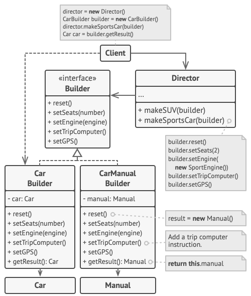

# Intent
Builder is a creational design pattern that lets you construct complex objects **step-by-step**.

# Structure

Copyright: [Refactoring Guru](https://refactoring.guru/design-patterns/builder)