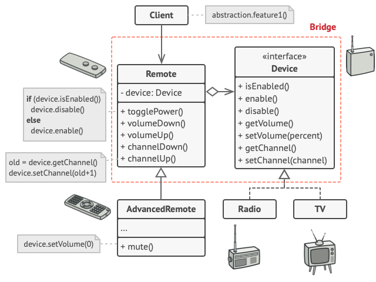

# Intent
Prototype is a creational design pattern lets you ensure that a class has only one instance, while providing a global access point to this instance.

# Structure

Copyright: [Refactoring Guru](https://refactoring.guru/design-patterns/bridge)

# Notes 
* The first step is to identify the **orthogonal dimensions** in the existing class.
* The client needs to pass an reference to the implementation object to initialize the instance of the abstraction class.
* The most significant advantage of bridge pattern is that it separates the monolithic class to seaparate hierarchies leaving that modification to one hierarchy won't interfere with the other hierarchy. This makes it more easy to maintain, and avoids the exponential subclasses. For example, if there's another device need to be added to the sample, then we don't need to implement another remote control class.