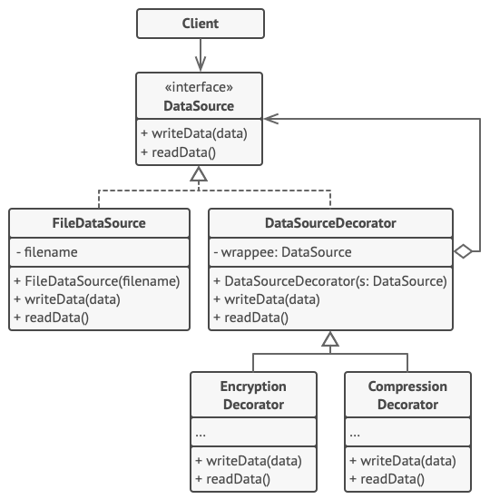

# Intent
Composite is a structural design pattern that lets you attach new behaviors to objects by placing these objects inside special wrapper objects that contain the behaviors.

# Structure

Copyright: [Refactoring Guru](https://refactoring.guru/design-patterns/decorator)

# Notes 
* As shown in the sample, all decorator classes have a constructor that takes the common interface `IDataSource`.
* As shown in the sammple output, this creates a layered output.

  