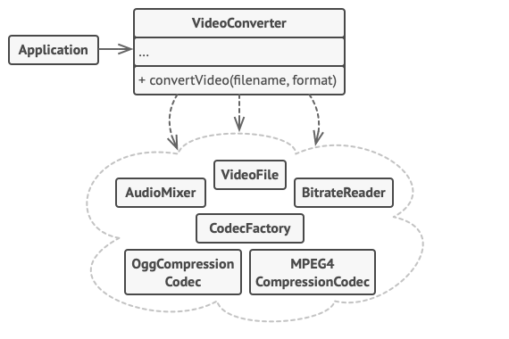

# Intent
Facade is a structural design pattern that provides a simplified interface to a library, a framework, or any other **complex set** of classes.

# Structure

Copyright: [Refactoring Guru](https://refactoring.guru/design-patterns/facade)

# Notes 
* Check if it's beneficial to create a facade which involves many of the subsystem's classes.
* The facade redirects the calls to the classes of the subsystems and manages the life cycle of the classes.
* Make **all** the client code communicate with the subsystem **only** via the facade.
* Split the facade class if it's getting larger.